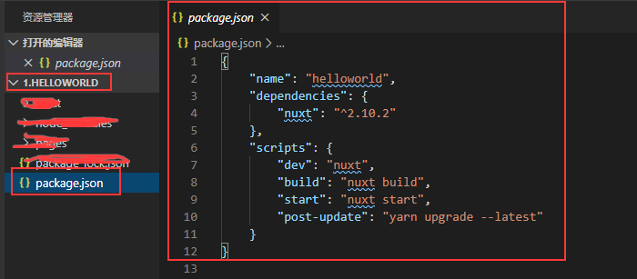
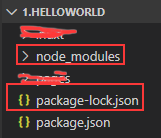
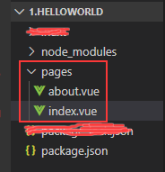
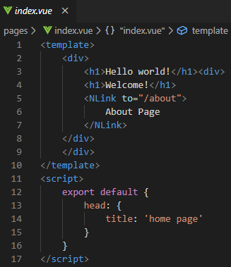
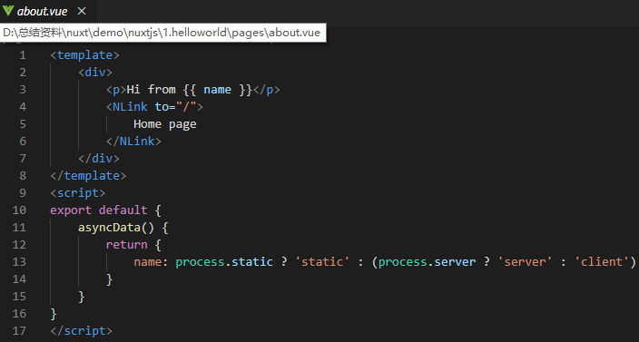
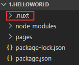
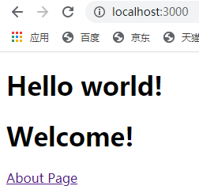
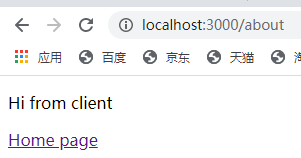

Nuxt helloworld 官网例子操作记录

根据官网的guide从头开始新建项目 步骤如下
1.	直接新建文件夹helloworld或者在cmd命令行里面输入mkdir helloworld新建文件夹
2.	我是在vs code里面操作的，在helloworld文件夹里面新建package.json文件，并在package.json写配置和操作内容。package.json文件用来设定如何运行nuxt。
 
3.	安装nuxt，打开终端或者cmd命令行输入 npm install –save nuxt或者npm i –s nuxt
会生成下图中一个依赖包和记录package的具体来源和版本号package-lock.json文件

4.	创建pages文件夹，nuxt会依据pages目录中的所有后缀为vue的文件生成应用的路由配置，新建index.vue和about.vue文件并编写相应代码

asyncData方法是在组件初始化前被调用的，所以在方法内是没有办法通过 this 来引用组件的实例对象。Api网址:https://www.bookstack.cn/read/nuxtjs-guide/preface.md

5.	回到终端或者cmd命令行输入npm run dev运行项目，项目启动成功会出现一个.nuxt文件夹   

