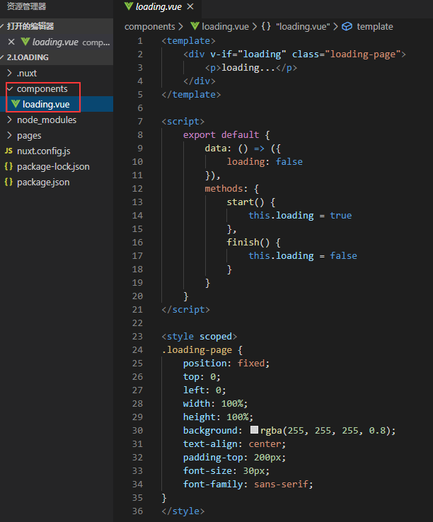
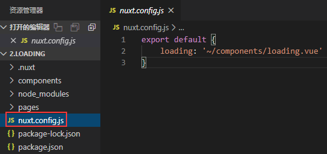
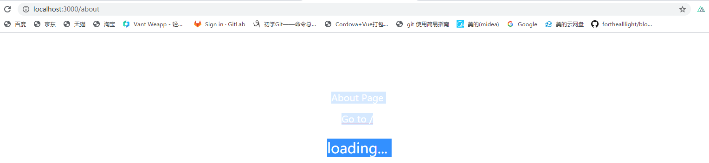

Nuxt loading官网例子操作记录

该例子是自定义组件加载示例，通过配置nuxt.config.js的loading属性来配置加载等待界面
1.	新建组件文件夹components并在该文件夹里面新建加载文件loading.vue
 loading，api网址:https://zh.nuxtjs.org/api/configuration-loading/
2.	新建nuxt.config.js,并配置loading属性，api同上网址或者
https://www.bookstack.cn/read/nuxtjs-guide/b0f7c4e68699ed55.md

3.	同样运行npm run dev，可以通过切换页面看到如下图

