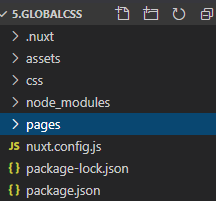
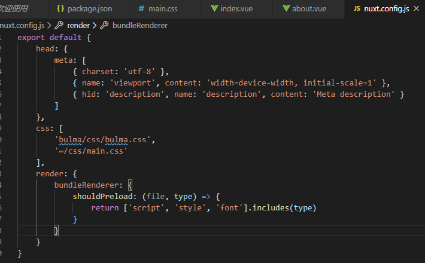
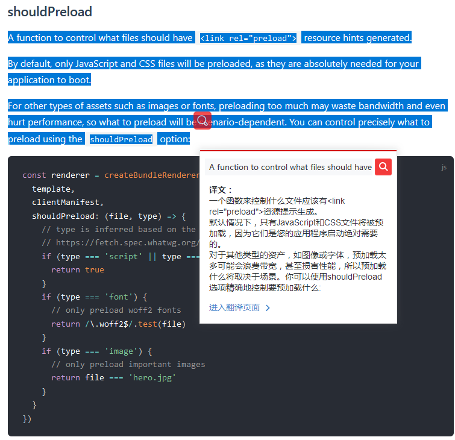

Nuxt global css官网例子操作记录

该例子是全局css示例， 这里使用了bulma css库，也自己编写了全局css main.css,main.css使用了字体的静态资源。
1.	该项目目录结构与nuxt.config.js配置如下，assets：静态资源目录，css：自定义样式目录。配置全局css是通过nuxt.config.js里面的css属性，
css api地址：https://www.bookstack.cn/read/nuxtjs-guide/9a040f6e6a1bd802.md。这里还做了预加载的render配置， render api：
https://www.bookstack.cn/read/nuxtjs-guide/1234f88d917e968f.md https://www.nuxtjs.cn/api/configuration-render

bundleRenderer属性可自定义vue SSR渲染器。spa模式会跳过此选项。
shouldPreload预加载属性如下图
shouldPreload api：https://ssr.vuejs.org/api/#clientmanifest

