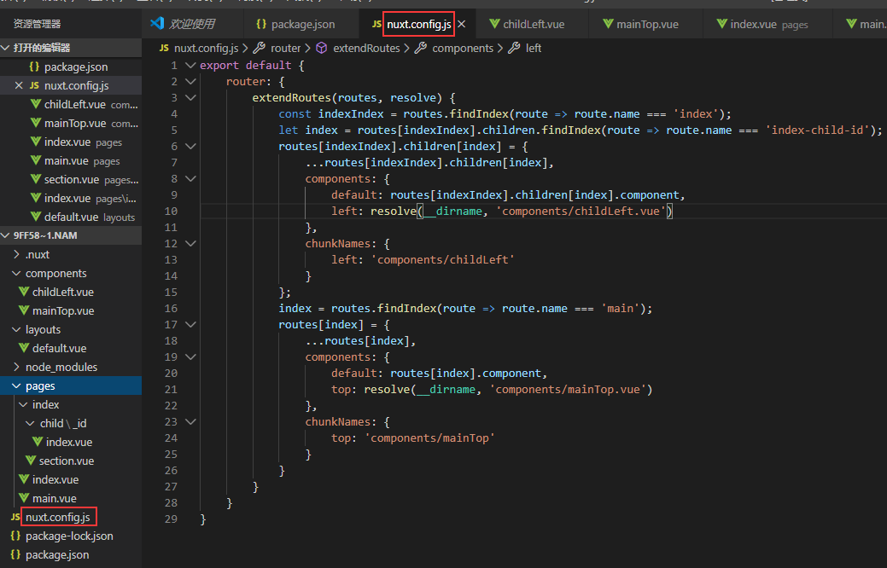
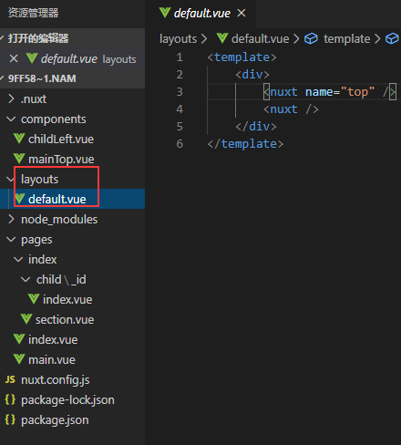
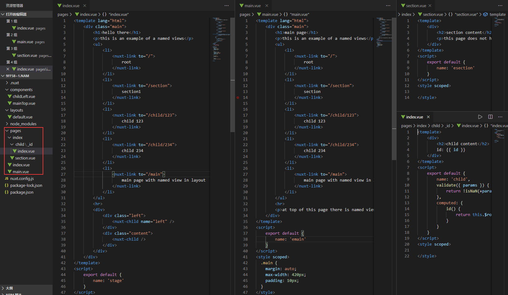

Nuxt named views官网例子操作记录

该例子是命名视图示例，该例子配置nuxt.config.js里面的extendRoutes属性，在components属性里面直接配置对应的命名视图。
1.	目录结构和nuxt.config.js配置如下,extendRoutes是作为路由的扩展配置，第一个参数包含pages目录生成的路由信息，第二个参数是解析方法，解析成绝对路径。可参考：https://www.jianshu.com/p/76966243f27f https://www.webpackjs.com/configuration/resolve/#resolve。在这里只需要直接给第一个参数对应路由地址改变参数值就可以做调整，这里使用到的命名视图，api：
https://www.bookstack.cn/read/nuxtjs-guide/2824b5cf681f22fe.md 在components这个属性里面，components里面的default是默认的命名视图，值为需要展示视图的绝对路径，例子中的left，top都是命名试图对应的名字，名字对应的是nuxt或者nuxt-child标签的name属性值，chunkNames属性也是必须对应命名视图配置上的。

2.	layouts目录和pages目录内容如下，在下图中可以发现有些nuxt或者nuxt-child带有name这个属性，name的属性值就是命名视图的名字，对应配置里面的命名属性键名。
还有需要注意组件的命名name属性不要跟标签名相同会出现报错，例子里面的main.vue和section.vue组件的name的值。

命名视图目的是多个视图的展示，而不是嵌套展示。理解可以看看这里                 
https://blog.csdn.net/muzidigbig/article/details/83717244
这里的pages\index\child\_id.vue里面有一个校验的参数配置validate用来校验路由参数是否符合要求。Api如下：
https://www.bookstack.cn/read/nuxtjs-guide/de40279e8576a808.md
