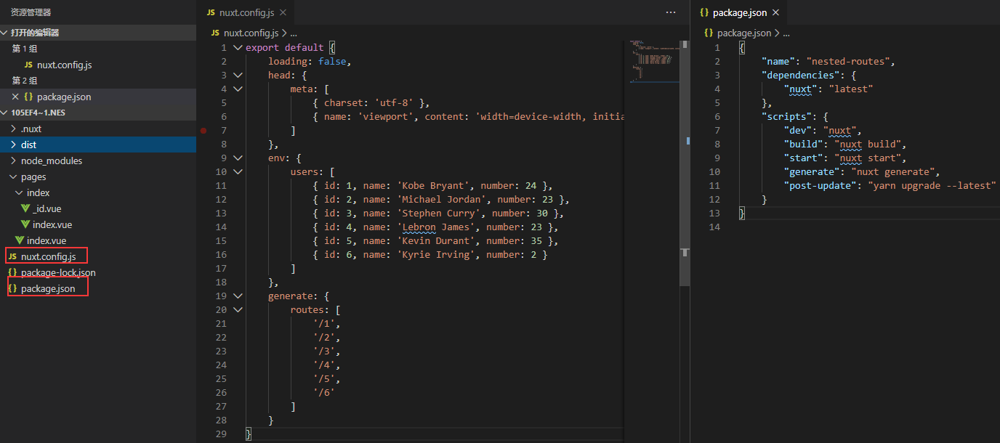
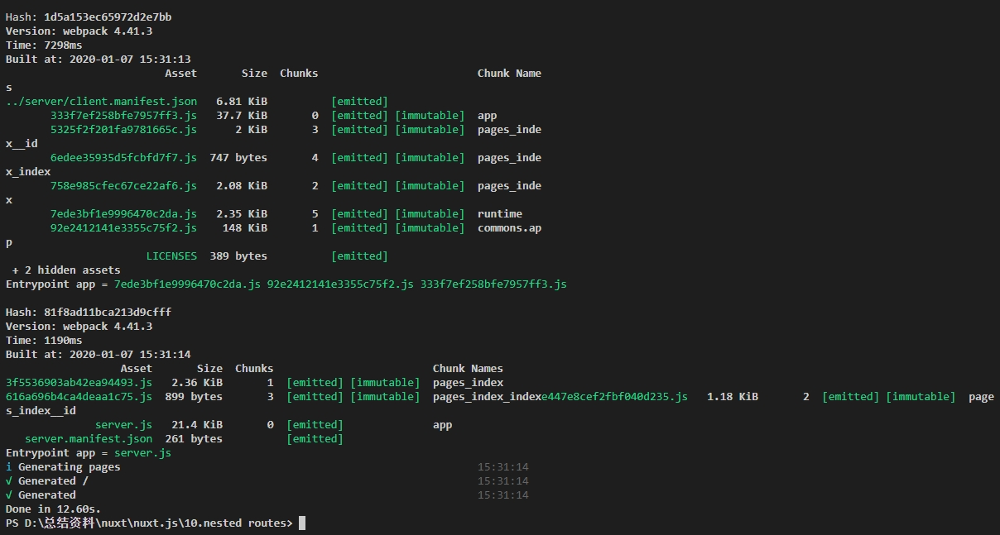
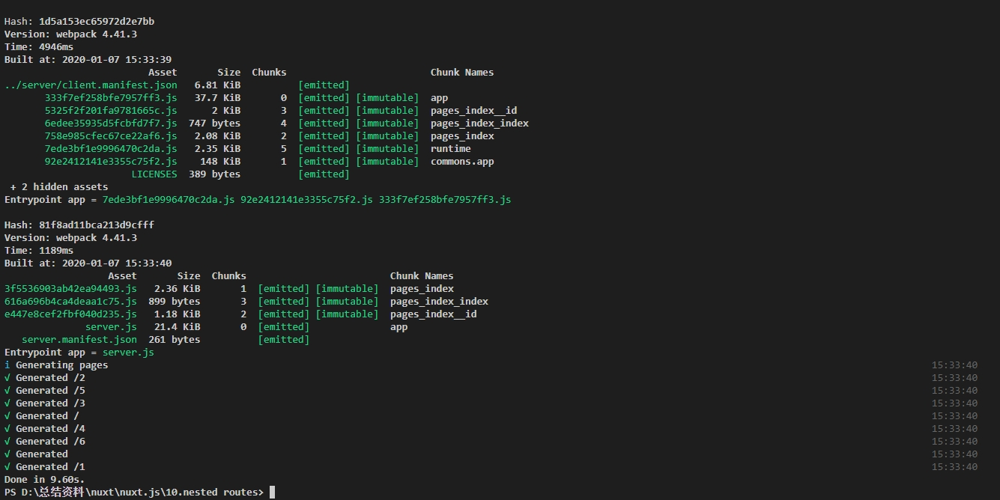
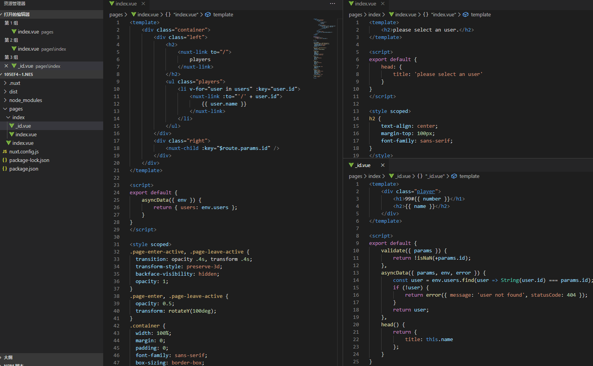

Nuxt nested routes官网例子操作记录

该例子是嵌套路由示例，核心在nuxt-child的使用上。这里还配置了generate.
1.	目录结构，package.json和nuxt.config.js配置如下，package.json里面新增了generate命令，nuxt.config.js配置了generate和env。generate属性配置让nuxt为动态路由也生成静态文件，而操作generate命令可以按照gennerate属性设置打包生成dist，如下图中为没有给generate配置，最后一图是配置了generate的。Generating pages信息或者dist的文件可以看到区别。 generate api：
https://www.bookstack.cn/read/nuxtjs-guide/945ea9c22e35848c.md
https://www.bookstack.cn/read/nuxtjs-guide/7db484990a67fed9.md
env api：https://www.bookstack.cn/read/nuxtjs-guide/452b9f9aec8b4b4a.md
https://www.bookstack.cn/read/nuxtjs-guide/3d09bc4304d68df0.md

2.	下图是pages目录结构和内容，这里可以跟动态路由做一个比较，如果编写pages下index.vue的动态路由只需同级编写_id.vue文件。而这里嵌套路由是pages下index.vue的下级路由分支，同名的index目录是index.vue的下级路由分支展示对应的是index.vue里面的nuxt-child。这里可以看到nuxt-child的key属性，理解可以参考网址：
https://blog.csdn.net/weixin_33795743/article/details/93266413 ，nuxt-child api:
https://www.bookstack.cn/read/nuxtjs-guide/f772e21aa99d0e9f.md

这里可以看到nuxt-child有动画效果，在这里是在pages下的index.vue 编写css设置的，可以看到样式里面有.page-enter.active等的样式，页面默认过渡是page，api：
https://www.bookstack.cn/read/nuxtjs-guide/8638d099c74ab4f7.md 下一个例子会运用到。
