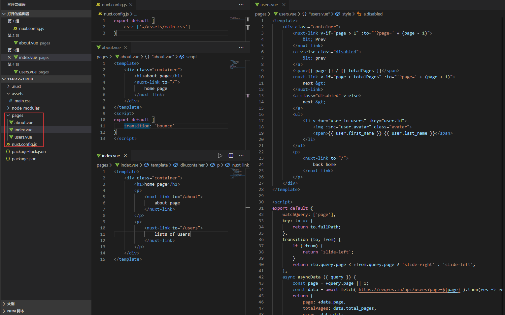
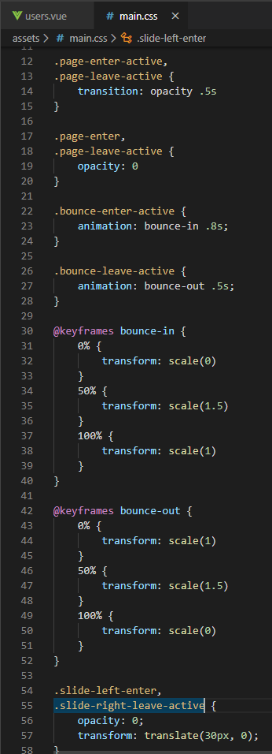

Nuxt routes transitions官网例子操作记录

该例子是路由过渡动态示例，其实就是页面过渡和布局过渡，在当前页或者在nuxt.config.js设置transition或者layoutTransition,api:
https://www.bookstack.cn/read/nuxtjs-guide/8638d099c74ab4f7.md
https://www.bookstack.cn/read/nuxtjs-guide/3c36e7d21f3e0662.md#object
1.	目录结构，nuxt.config.js和pages目录及内容如下图，这里是全局引入main.vue。about.vue界面设置了页面过渡效果bounce，users.vue里面用transition的函数方式返回路由的过渡效果。

2.	过渡效果的样式是在main.vue这个全局css里面，主要内容如下图，是一些简单的动画效果

在users.vue里面出现了watchQuery属性，这使用来监听参数字符串的改变的，如果改变会调用所有组件，api：
https://www.bookstack.cn/read/nuxtjs-guide/f5ccc44a96a2331c.md
