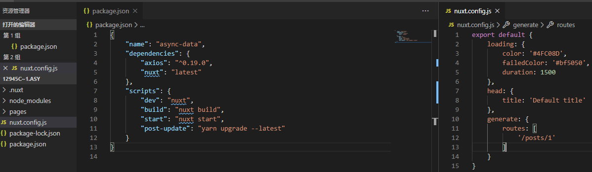
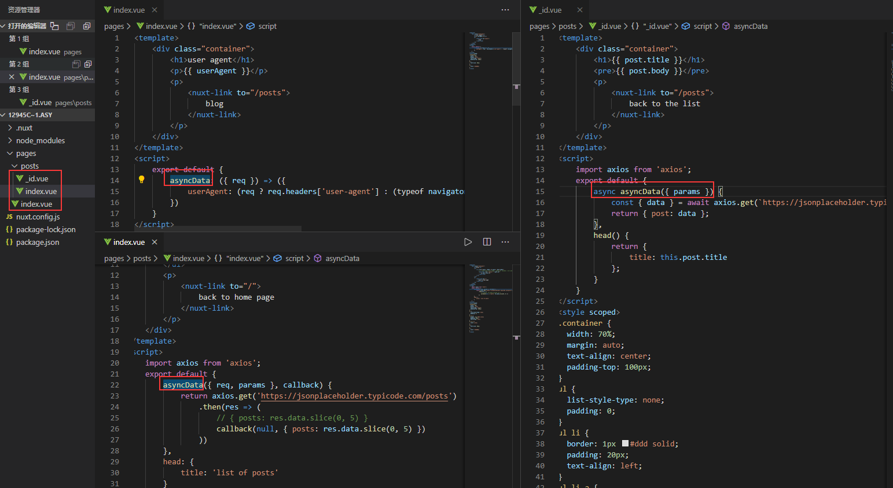

Nuxt async data官网例子操作记录

该例子是异步数据示例，核心是asyncData，它的作用是组件初始化之前被调用，api：
https://www.bookstack.cn/read/nuxt.js-tutorial-0.10.7/async-data.md。
1.	目录结构，package.json和nuxt.config.js如下图，这里的配置了一个加载等待条loading的样式，使用了axios异步请求数据。

2.	pages里面的内容文件是这里的重点，特别asyncData的使用方式，异步有三中方式，都在下图结合api文档可以看到。

