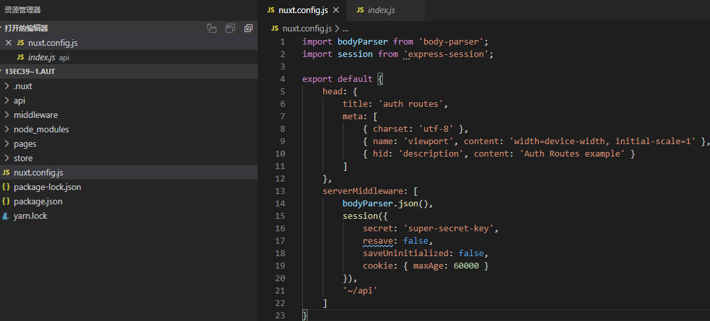

Nuxt auth routes官网例子操作记录

该例子是路由鉴权示例，这个跟vue中的路由卫士router.beforeEach有共同的效果，而这里的例子使用的是中间件的方式，多看几次会发现这种方式的上下文的数据会连接更加紧密，主要是单纯的vue没有上下文这个概念，需要手动自己弄，而这里纯天然直接使用。
1.	目录结构和nuxt.config.js如下，这里在serverMiddleware配置了三个服务端需要用到的中间件 api：https://www.bookstack.cn/read/nuxtjs-guide/e197861b1bc90bd3.md ，body-parser（作用是http请求体解析中间件，该例子的请求体会直接变成json结构，api：http://www.expressjs.com.cn/en/resources/middleware/body-parser.html
理解可以看看这个: https://www.jianshu.com/p/ea0122ad1ac0 ），express-session(能够标记客户端在服务器上的状态。可以用服务器端的session storage理解。api：
http://www.expressjs.com.cn/en/resources/middleware/session.html 理解可以看看：
https://www.cnblogs.com/mingjiatang/p/7495321.html )

2.	下图是store目录，middleware目录和api目录以及各内容，store/index.js这里的nuxtServerInit是连接客户端与服务器数据的，api：
https://www.bookstack.cn/read/nuxtjs-guide/fb64e51b91e66c31.md。
api/index.js中的path和handler参看serverMiddleware的api。

3.	pages目录下的内容如下，也可以看到红圈中vuex的权限判断和组件的中间件调用。

