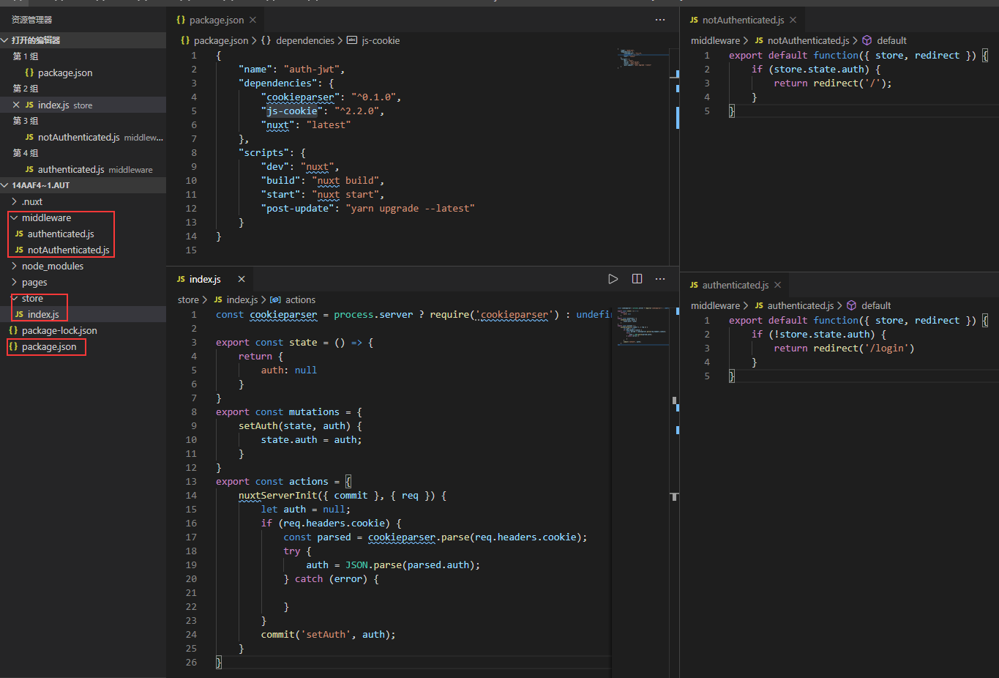
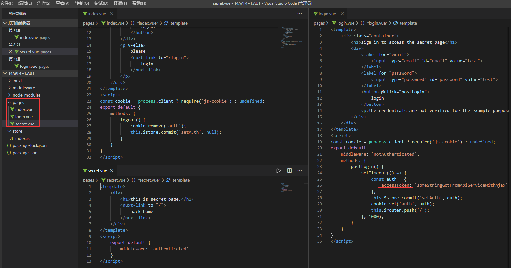

Nuxt auth external api JWT官网例子操作记录

该例子是跨域身份验证示例，例子弄得有点简单有点像路由鉴权，可以看看这个：
https://jwt.io/introduction/，
https://scotch.io/tutorials/the-ins-and-outs-of-token-based-authentication
跟路由鉴权session的区别：https://blog.csdn.net/qq_41606973/article/details/85220049
1.	目录结构，package.json, store目录，middleware目录以及内容如下图，这里使用到cookieparse和js-cookie中间件，cookieparse可以把key=value 变成 {key:value}
api：https://www.npmjs.com/package/cookieparser。
js-cookie其实就是cookie的封装，api：https://www.npmjs.com/package/js-cookie
在这里没有做密码账户的校验只是针对token，这里全都是一个token所以任意账号都可以操作

2.	pages目录和内容如下图，上面说到的token就是红圈那个。

