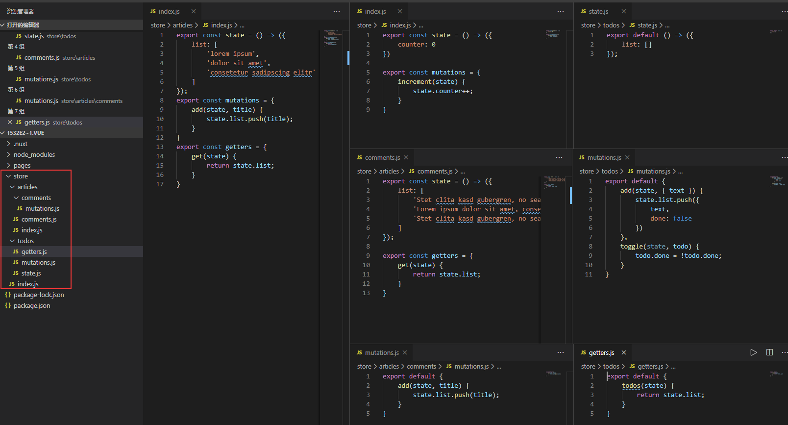
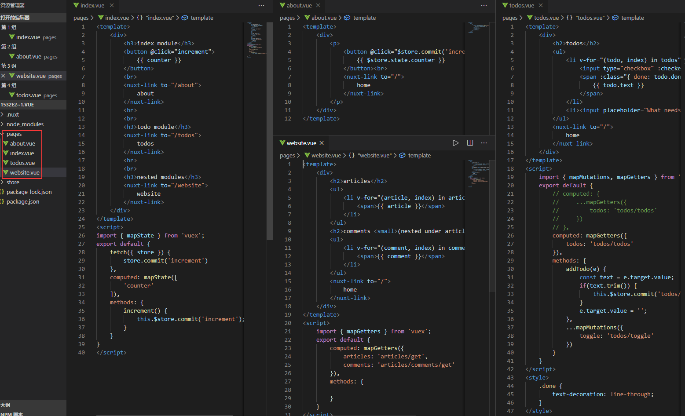

Nuxt vuex store官网例子操作记录

该例子是vuex状态树示例，官网的解析已经比较清晰，nuxt把vuex做了合理性优化
https://zh.nuxtjs.org/guide/vuex-store/。
1.	store目录和内容如下图，js文件名就是模块名，文件夹名也是模块名，文件夹下的getters,mutations,state,actions这些命名的js分别对应vuex几个属性。

2.	pages目录和内容如下图，在index.vue里面可以看到fetch，跟asyncData类似也是组件初始化前调用，作用到vuex数据而不是组件的数据。Api：
https://www.bookstack.cn/read/nuxtjs-guide/4b85bbd971c77c24.md

