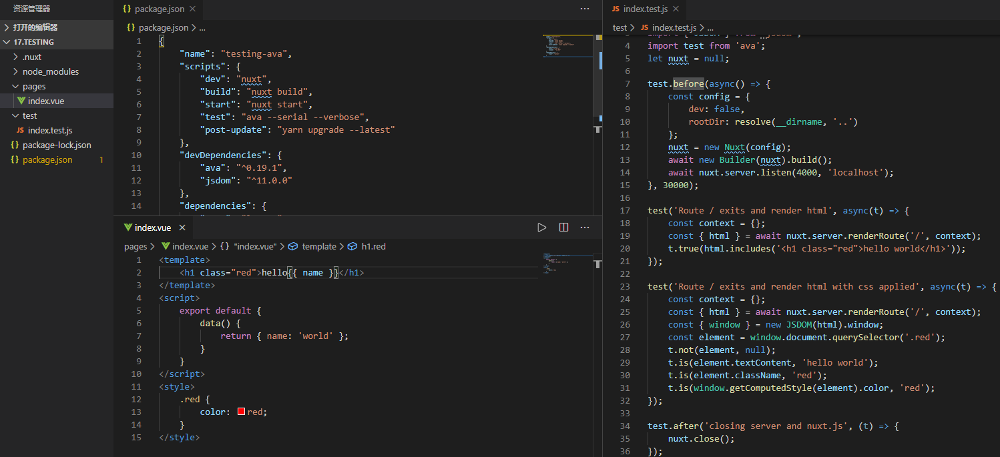
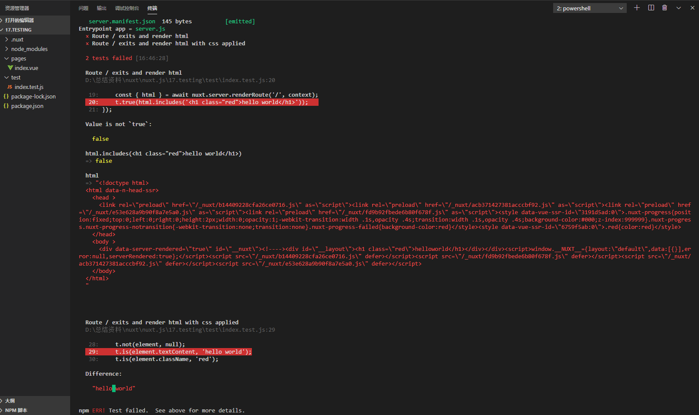

Nuxt testing官网例子操作记录

该例子是测试示例，单元测试就是这里了，这里使用到ava自动化测试 文档：https://www.npmjs.com/package/ava
这个应该是相对比较好的，翻墙观看比较快：
https://github.com/avajs/ava-docs/blob/master/zh_CN/readme.md
观看这个https://eggjs.org/zh-cn/core/unittest.html可以了解到单元测试。
操作流程看这里可以有个大概答案：https://juejin.im/entry/597e88035188257f833d3bb8。

1.	主要代码如下，package.json那里可以看到test执行命令。test目录下的index.test.js就是自行编写测试文件，是用来测试pages目录下index.vue的。

2.	执行npm test，会得到下图，上图可以看到pages/index.vue里面第二行hello{name}，测试要求是20行和29行hello和world之间是有空格的，所以报错了。

在测试里面，ava新建了一个项目nuxt，启动4000端口服务，在服务端可以得到返回的html数据在19行，那样可以测试html是否含有指定字符串信息。接着使用jsdom模拟浏览器环境进行dom内容测试，类名测试和样式测试，最后关闭4000端口服务。
jsdom：https://github.com/jsdom/jsdom
