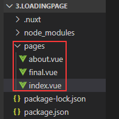
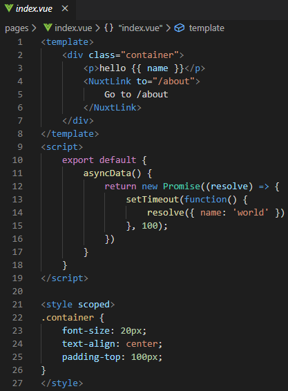
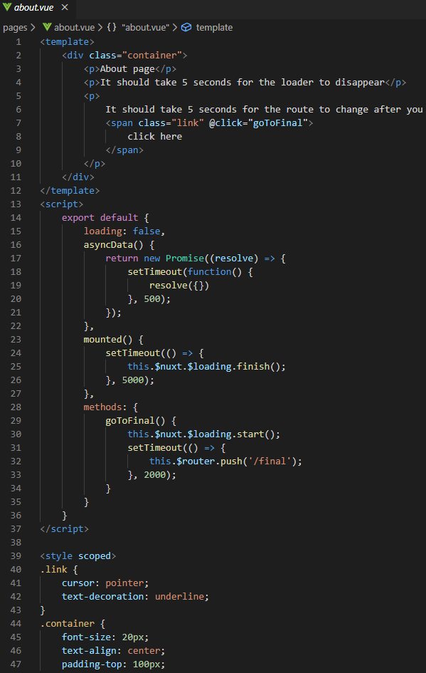
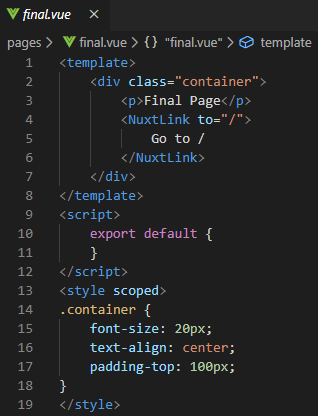
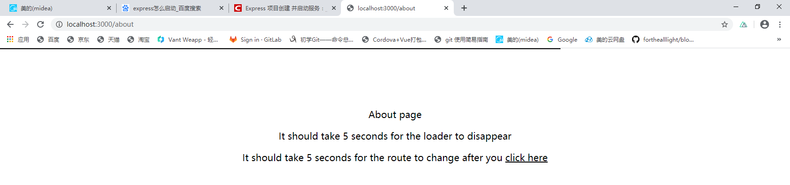

Nuxt loading官网例子操作记录

该例子是自定义页面加载示例，当nuxt.config.js不设置loading属性或者loading为false时，某些页面需要加载等待页面这个时候可以使用this.$nuxt.$loading来start和finish加载条
1.	在pages文件夹里面新建index,vue,about.vue,final.vue,如下图

loading，api网址:https://zh.nuxtjs.org/api/configuration-loading/
注意：如果在mounted中启动loading时候需要确保在this.$nextTick调用
2.	同样运行npm run dev，可以通过切换页面看到如下图，可以观察到页面上方有一条进度条模样的线

因为这个自定义页面加载可以不需要在nuxt.config.js设置loading,所以在这个例子不出现这个文件了。
