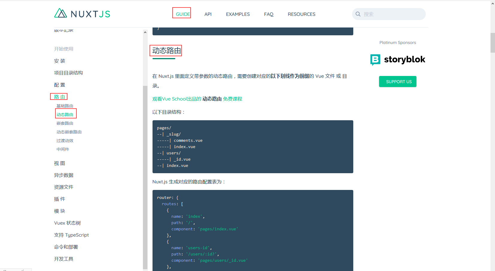
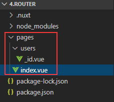
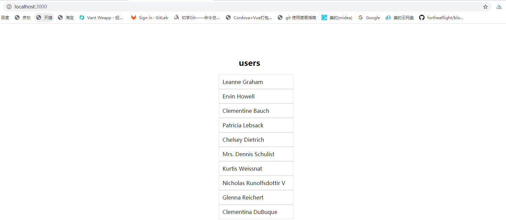

Nuxt router官网例子操作记录

该例子是自定义路由示例，也就是官网guide路由文档里面的动态路由，如下图

Nuxt的路由是默认动态生成的，只需要在pages目录里面编写vue文件就可以自动生成路由配置表，简单来讲就是pages目录结构就是路由的层级结构，如上图。
1.	编写package.json,这里动态路由的数据生成是请求接口数据的，用到axios这个异步请求，api可以看http://axios-js.com/docs/
2.	编写pages目录如下图

   pages目录下的index.vue文件是默认界面入口，动态路由文件夹users里面的_id.vue,这里的下划线就是一个动态的信号，后面的id就是路由参数，页面如下图，左首页右动态路由页面

路由的文档说明：
https://www.bookstack.cn/read/nuxtjs-guide/2824b5cf681f22fe.md
nuxt.config.js配置router属性api文档：
https://www.bookstack.cn/read/nuxtjs-guide/70dba7b5b8026028.md
https://www.nuxtjs.cn/api/configuration-router
