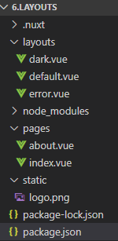
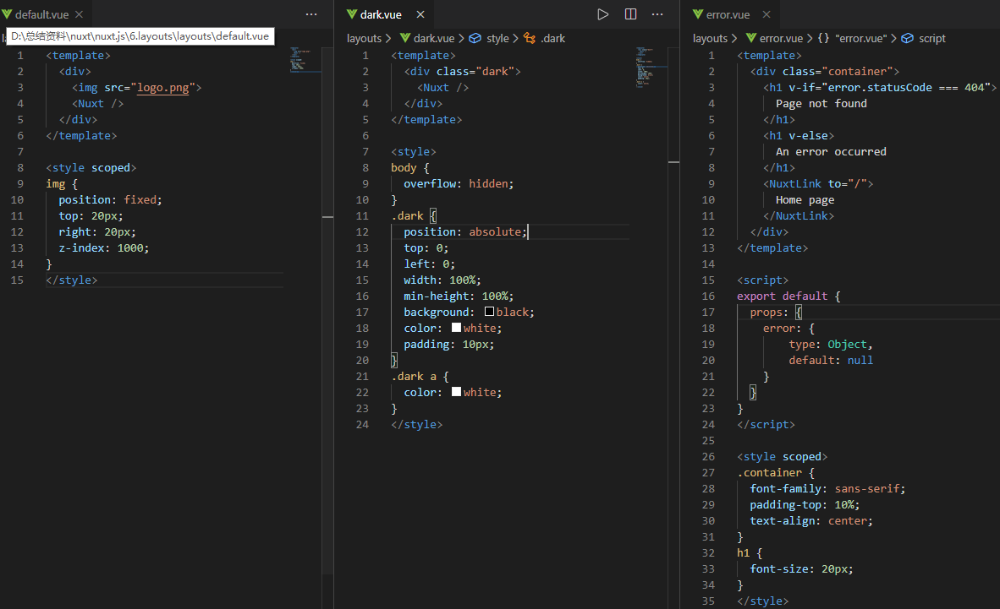
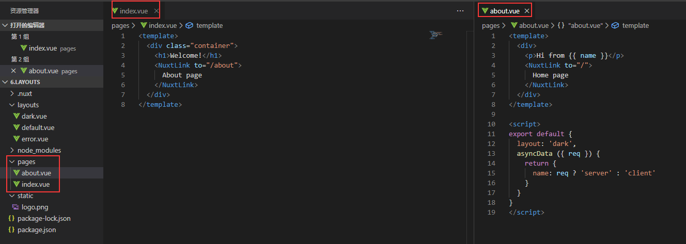
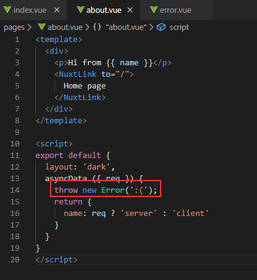
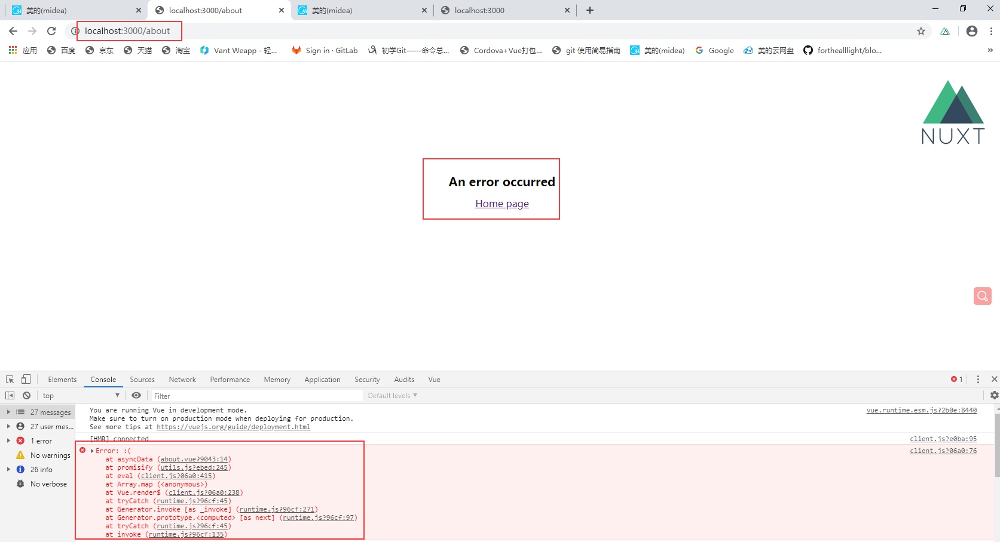

Nuxt layouts官网例子操作记录

该例子是布局示例，感觉用模板更加贴切，我是这么理解的。官方这么说的
layouts 根目录下的所有文件都属于个性化布局文件，可以在页面组件中利用 layout 属性来引用。
在这里还用了static静态文件目录，
静态文件目录 static 用于存放应用的静态文件，此类文件不会被 Nuxt.js 调用 Webpack 进行构建编译处理。服务器启动的时候，该目录下的文件会映射至应用的根路径 / 下。
1.	目录结构和layouts如下图
Api: https://www.bookstack.cn/read/nuxtjs-guide/05a37fbddd15a9fb.md

2.  编写pages目录文件如下图

pages的默认布局是layouts里面的default.vue，当pages里面的vue文件设置了layout属性时候，布局会映射到layouts目录里面的对于文件名，pages目录下的vue文件内容会在layouts目录下对应的布局文件的<nuxt />展示出来。<nuxt-link></nuxt-link>用作跳转页面类似a标签。api: https://www.bookstack.cn/read/nuxtjs-guide/api-components.md。
在layouts目录的default.vue文件可以看到里面的img标签引入的logo.png就是映射到static静态文件目录。
调用layouts里面error.vue错误页面，throw new Error()如下图

