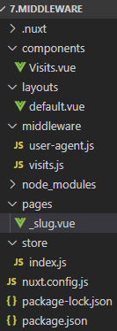
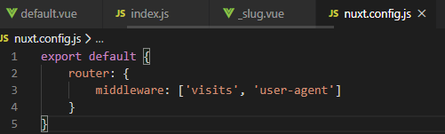
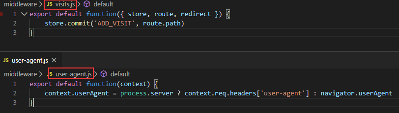
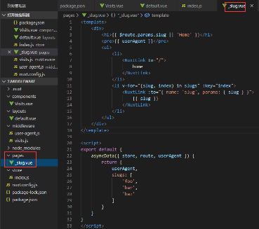
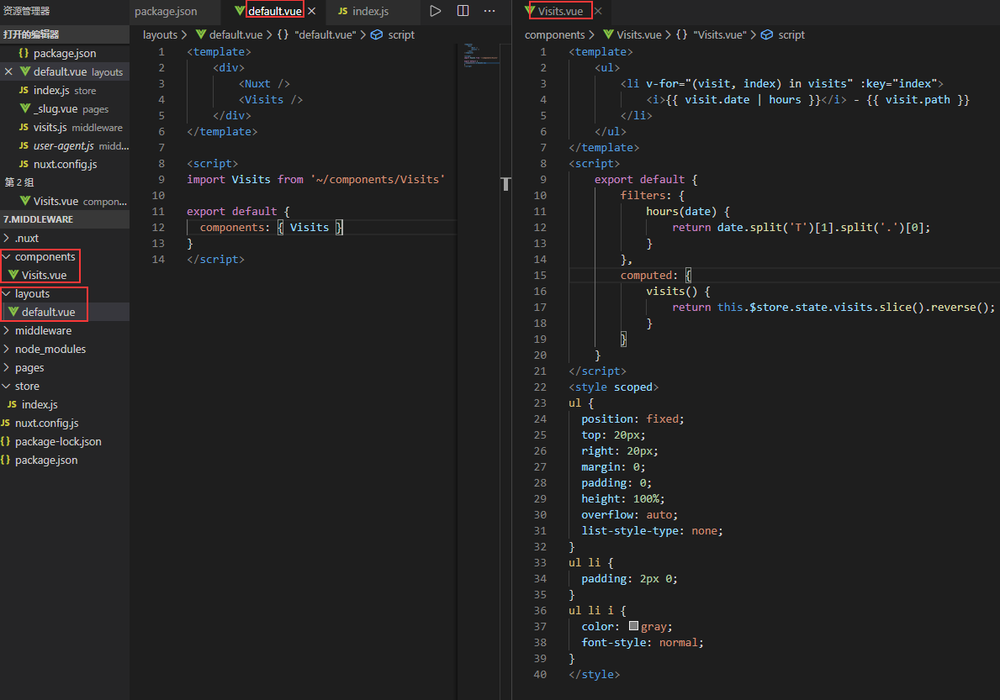
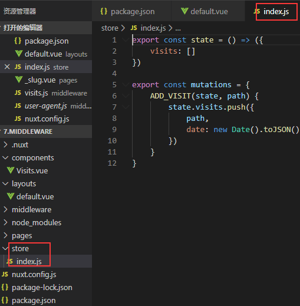

Nuxt middleware官网例子操作记录

该例子是中间件示例，该例子配置nuxt.config.js里面的router属性，添加middleware属性设置每页渲染前运行所需的中间件的逻辑。
1.	目录结构和nuxt.config.js配置，middelware目录文件如下图。配置路由的中间件的api：
https://www.bookstack.cn/read/nuxtjs-guide/70dba7b5b8026028.md#middleware
运行顺序是从左往右的，运行的中间件对应middleware里面的js文件名，中间件的参数context包含很多上下文的信息。
https://www.bookstack.cn/read/nuxtjs-guide/2824b5cf681f22fe.md#%E4%B8%AD%E9%97%B4%E4%BB%B6

2.	pages目录，这里直接就是动态路由，默认指向的路由位置就是/:slug,为空的时候就是/

3.	components组件，layouts布局和store目录如下：
components组件的使用跟普通的vue一样引入注册使用。
这里有个nuxt-link使用的to使用对象的方式的，使用跟router-link一样的，api：
https://router.vuejs.org/zh/api/。
store对应的是vuex状态树https://www.nuxtjs.cn/guide/vuex-store。

