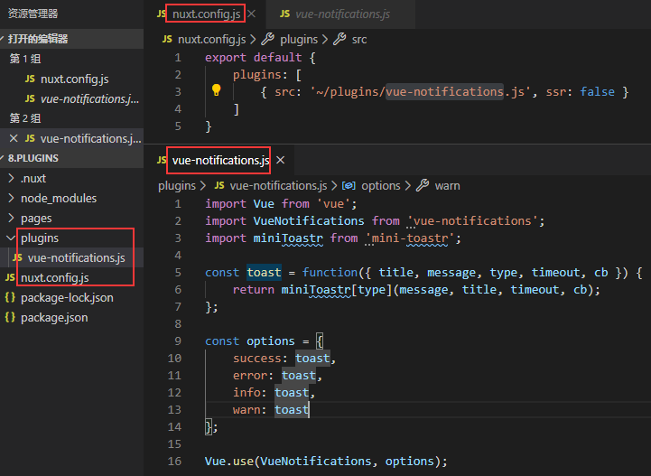
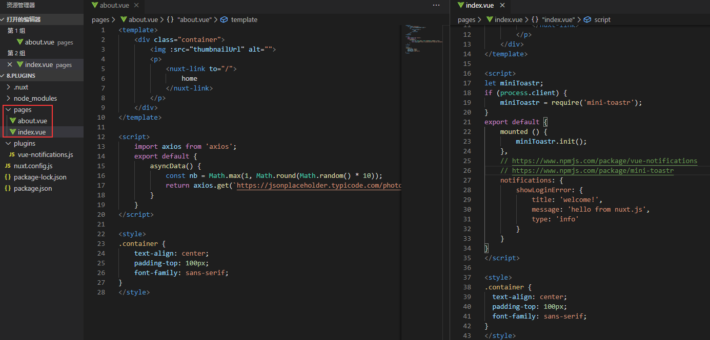

Nuxt plugins官网例子操作记录

该例子是插件示例，该例子配置nuxt.config.js里面的plugins属性，这里用vue-notifications加mini-toastr作为插件例子。
1.	目录结构，nuxt.config.js配置和plugins插件目录的插件文件如下图，配置中插件属性plugins可以有多种模式在这里使用的是客户端插件模式，所以ssr为false，api：
https://www.bookstack.cn/read/nuxtjs-guide/6d866ce976d0f8c0.md#%E4%BD%BF%E7%94%A8-vue-%E6%8F%92%E4%BB%B6
https://www.bookstack.cn/read/nuxtjs-guide/76e65d92864112c2.md

在插件这个文件里面用的是vue-notifications和mini-toastr，api分别：
https://www.npmjs.com/package/vue-notifications
https://www.npmjs.com/package/mini-toastr
2.	pages文件夹和里面的内容如下图，index.vue里面的notifications在这里其实等同methods的，上面的api文档那里说明了
s

这里主要是插件的使用会比较让人难懂，多看几次api可以慢慢找到使用方式。配置plugins这个属性会有好多种模式，只客户端使用的，只服务端使用的，同时使用的，注入的方式又有用use注入，原型挂载函数的，inject注入。还有添加扩展名的引入。Api都有说到，使用的不同的插件要看不同插件的api配合运用。
